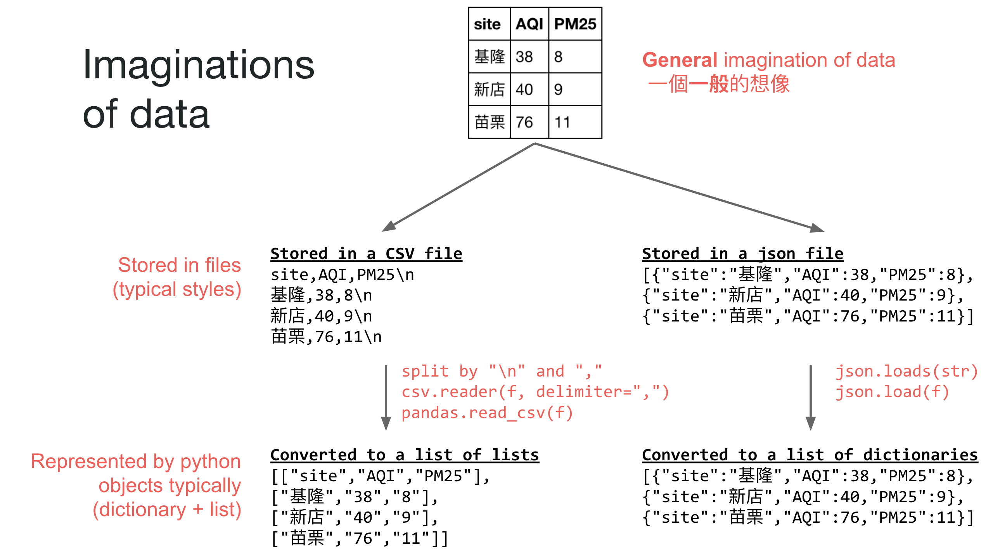
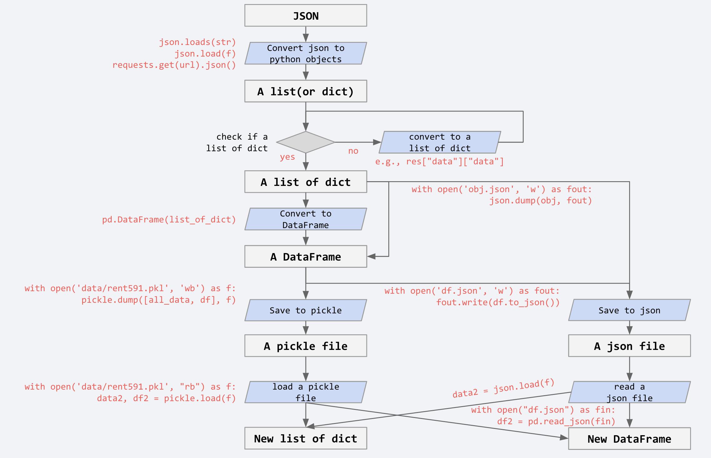

# https://github.com/P4CSS/PSS107
* 講師：林明仁教授（經濟系）、謝吉隆副教授（新聞所）、黃瀚萱博士後研究員（台大資工所）
* 助教與諮詢時間：
  * 陳亮丞（經濟系）：b03302212[@]ntu.edu.tw
  * 陳欣宜（資管四）：b04705024[@]ntu.edu.tw
* 請假方式：請一律由[學生請假系統](http://advisory.osa.ntu.edu.tw/editor_model/u_editor_v1.asp?id={D1577A6B-F9BE-4448-97E8-78E4D04AF572})請假，如未到課未假者，酌扣學期總成績3分。
* nbviewer: http://nbviewer.jupyter.org/github/P4CSS/PSS107/tree/master/

# Announcement
* HOT! [Open data copnference](https://github.com/P4CSS/p4css.github.io/blob/master/img/competition.jpg) for you (Due: 11/30)
* [Interesting open data](https://github.com/P4CSS/p4css.github.io/blob/master/data.md)
* [Rundown](rundown.md)

# Grading
* 缺席 -3%: 請一律由[學生請假系統](http://advisory.osa.ntu.edu.tw/editor_model/u_editor_v1.asp?id={D1577A6B-F9BE-4448-97E8-78E4D04AF572})請假，如未到課未假者，酌扣學期總成績3分。
* 作業 50%： 平均每週會出一個作業，重點在於練習而非挑戰，估計作業時間到第二、三週後平均每週需要花1~4小時不等。全然聽懂上課所述可能可以在半小時內寫完。若超過8小時仍無法解決作業，請在上課前找同學求解。分數由作業總數進行平均，基礎部分佔25%、文字探勘部分佔25%。
* 專題 50%: 

# Calendar

## 1025 Text mining 1

## 1018 basic crawler
* [P8_PTTCrawler.ipynb](P8_PTTCrawler.ipynb)
* [Slide Inspecting web page](https://docs.google.com/presentation/d/e/2PACX-1vSrIfJQJpr_24wwIjMaTMKiq_xrhZ5n-J26G7xbXC1HIMMKWfMsm6zFWOsX8NxNEN_S46z9PnsASj32/pub?start=false&loop=false&delayms=3000)
* [Assignments.md#assignment-5-1018](Assignments.md#assignment-5-1018) No later than 10/24 23:59

## 1011 Get web jsons
* [P06_get_web_json.ipynb](P06_get_web_json.ipynb): Get json files from the web
* Using pandas to import data and transfer to python list and dictionary.
* https://github.com/P4CSS/PSS107/blob/master/Assignments.md#assignment-4-1011

## 1004 Dictionary, loop, and condition
* [P03_list_dictionary.ipynb](P03_list_dictionary.ipynb): (Next) iterating key and value in dictionary by for-loop
* [P04_read_csv_json.ipynb](P04_read_csv_json.ipynb): Reading CSV files
* [P04_for_if_else.ipynb](P04_for_if_else.ipynb)
* [Assignment #3](https://github.com/P4CSS/PSS107/blob/master/Assignments.md#assignment-3-1004): No later than 10/10 23:59

## 0927 python basic II
* [Assignment #2](https://github.com/P4CSS/PSS107/blob/master/Assignments.md#assignment-2) No later than 10/03 23:59. Submitting your **.ipynb** file and rendered **.html** file (zip them and upload to ceiba). 
* P01_print_variable
* P02_list_dictionary

## 0920 Python basic
* [Assignment #1](https://github.com/P4CSS/PSS107/blob/master/Assignments.md#assignment-1) 09/26 23:59 due
* [Slide: Py01_Starting_Python](https://docs.google.com/presentation/d/1zv7r_5NVGFS7INs6RJdP3F9v526PBar2TNSW9QjuyVk/edit?usp=sharing)
* You are encouraged to print out P0_counting.ipynb file.
* Video for the counting problem https://youtu.be/Sw0_lGVfyeM
* Video for expanded counting problem https://youtu.be/IWwSU033qmU

## 0913 Course overview
* [slide](https://docs.google.com/presentation/d/e/2PACX-1vQzvayR4PL4yXdOOU6r0bSrqPkSF6Ls-QQ3ul9dtSTrMwHs7eS7xxWZOnoS3vRAFEP6pfizLBfBbPaJ/pub?start=false&loop=false&delayms=3000)
* [Survey](https://goo.gl/forms/Zch5gVBVMnnXoyUR2)

# Images

## Imaginations of data and data processing

## Converting between A list of dict, DataFrame, json, and pickle

